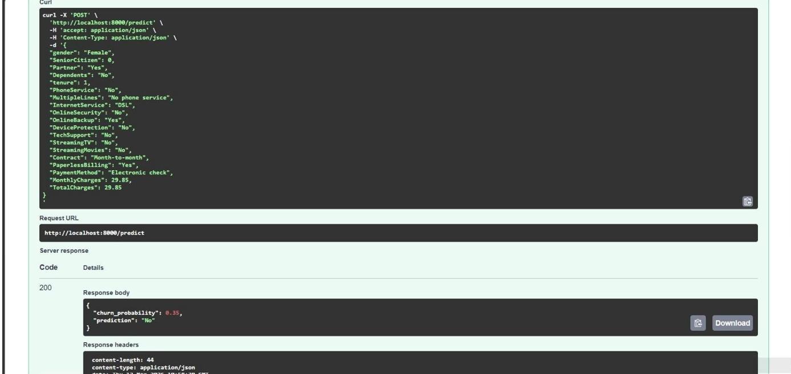
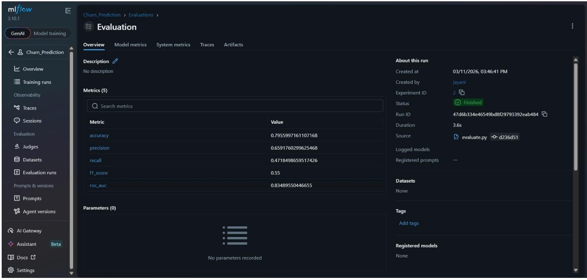
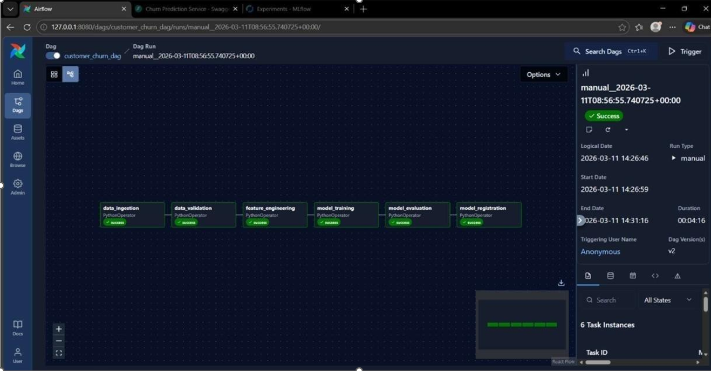

# Customer Churn Prediction — MLOps Pipeline

An end-to-end **Machine Learning Operations (MLOps)** project that predicts customer churn for telecom and subscription businesses. The pipeline covers data ingestion, validation, preprocessing, model training, evaluation, experiment tracking, workflow orchestration, and real-time inference via a REST API.

[GitHub](https://github.com/dewmiabeykoon/churn-prediction-mlops)

---

## Overview

Customer churn is a critical challenge for subscription-based businesses. This project builds a production-style ML system that:

- Predicts whether a customer is likely to churn
- Scores churn probability for each customer
- Automates the full ML lifecycle using industry-standard MLOps tools
- Serves predictions through a FastAPI endpoint
- Demonstrates LLM-based personalized retention offers for at-risk customers

---


## Features

- Automated ML pipeline from raw data to deployed model
- Multiple classifier comparison (Logistic Regression, Random Forest, XGBoost)
- Automatic best-model selection based on F1 score
- Experiment tracking and artifact logging with **MLflow**
- Data and pipeline versioning with **DVC**
- Workflow orchestration with **Apache Airflow** (Astronomer)
- REST API for real-time churn predictions
- Model evaluation with confusion matrix and ROC curve artifacts
- Bonus: LLM-based retention incentive generator

---


## Tech Stack


| Category                | Tools                                 |
| ----------------------- | ------------------------------------- |
| **ML / Data**           | Python, pandas, scikit-learn, XGBoost |
| **Experiment Tracking** | MLflow                                |
| **Pipeline Versioning** | DVC                                   |
| **Orchestration**       | Apache Airflow (Astronomer)           |
| **API Serving**         | FastAPI, Uvicorn                      |
| **Containerization**    | Docker                                |


---


## Architecture

```
┌─────────────────┐     ┌─────────────────┐     ┌─────────────────┐
│  Data Ingestion │────▶│  Preprocessing  │────▶│  Model Training │
└─────────────────┘     └─────────────────┘     └─────────────────┘
         │                        │                        │
         ▼                        ▼                        ▼
┌─────────────────┐     ┌─────────────────┐     ┌─────────────────┐
│ Data Validation │     │ Feature Scaling │     │   Evaluation    │
└─────────────────┘     └─────────────────┘     └─────────────────┘
                                                          │
                                                          ▼
┌─────────────────┐     ┌─────────────────┐     ┌─────────────────┐
│  FastAPI Serve  │◀────│ Model Register  │◀────│  MLflow Logging │
└─────────────────┘     └─────────────────┘     └─────────────────┘
```


### Pipeline Stages

1. **Data Ingestion** — Downloads the IBM Telco Customer Churn dataset
2. **Data Validation** — Checks required columns and dataset integrity
3. **Preprocessing** — Cleans data, encodes categories, scales features, splits train/test
4. **Model Training** — Trains and compares three classifiers; saves the best model
5. **Evaluation** — Computes metrics, generates visualizations, logs to MLflow
6. **Model Registration** — Registers the production model in MLflow Model Registry
7. **API Serving** — Exposes predictions via HTTP endpoints

---


## Project Structure

```
churn-prediction-mlops/
├── src/
│   ├── data_ingestion.py      # Download raw dataset
│   ├── validate_data.py       # Validate raw data quality
│   ├── preprocessing.py       # Clean, encode, scale, split
│   ├── train.py               # Train and compare models
│   ├── evaluate.py            # Evaluate and log metrics
│   └── register_model.py      # Register model in MLflow
├── dags/
│   └── churn_dag.py           # Airflow DAG for pipeline automation
├── tests/
│   └── dags/
│       └── test_churn_dag.py  # DAG integrity tests
├── models/                    # Trained model and artifacts (generated)
├── data/
│   ├── raw/                   # Raw dataset
│   └── processed/             # Processed train/test splits
├── app.py                     # FastAPI prediction service
├── bonus_llm.py               # LLM retention offer demo
├── dvc.yaml                   # DVC pipeline definition
├── requirements.txt           # Python dependencies
├── Dockerfile                 # Astro Runtime container
└── .env.example               # Environment variable template
```

---


## Project Showcase

Screenshots from the cleaned and production-ready MLOps pipeline:

### FastAPI Prediction API

Interactive Swagger docs for real-time churn prediction.



### MLflow Experiment Tracking

Model comparison across Logistic Regression, Random Forest, and XGBoost.



### Airflow Pipeline Orchestration

End-to-end DAG with 6 automated pipeline stages.



### Model Evaluation

Confusion matrix and ROC curve from model evaluation.


---


## Getting Started


### Prerequisites

- Python 3.9+
- [Docker](https://www.docker.com/) (for Airflow)
- [Astronomer CLI](https://www.astronomer.io/docs/astro/cli/install-cli) (optional, for Airflow)
- [DVC](https://dvc.org/doc/install) (optional, for pipeline versioning)


### Installation

```bash
git clone https://github.com/dewmiabeykoon/churn-prediction-mlops.git
cd churn-prediction-mlops

python -m venv venv
venv\Scripts\activate          # Windows
# source venv/bin/activate     # Linux / macOS

pip install -r requirements.txt
cp .env.example .env             # Linux / macOS
# copy .env.example .env         # Windows
```

---


## Usage


### Run the Full Pipeline (DVC)

```bash
dvc repro
```

Or run individual stages:

```bash
python src/data_ingestion.py
python src/validate_data.py
python src/preprocessing.py
python src/train.py
python src/evaluate.py
python src/register_model.py
```


### Run with Apache Airflow

```bash
astro dev start
```

Open the Airflow UI at [http://localhost:8080](http://localhost:8080) and trigger the `customer_churn_dag` DAG.

```
data_ingestion → data_validation → feature_engineering → model_training → model_evaluation → model_registration
```


### Start the Prediction API

```bash
python app.py
```

- API: [http://localhost:8000](http://localhost:8000)
- Swagger docs: [http://localhost:8000/docs](http://localhost:8000/docs)

---


## API Reference


### `GET /health`

Returns service health and confirms model artifacts are loaded.

### `POST /predict`

Predict customer churn probability.

**Request Body:**

```json
{
  "gender": "Female",
  "SeniorCitizen": 0,
  "Partner": "Yes",
  "Dependents": "No",
  "tenure": 12,
  "PhoneService": "Yes",
  "MultipleLines": "No",
  "InternetService": "Fiber optic",
  "OnlineSecurity": "No",
  "OnlineBackup": "Yes",
  "DeviceProtection": "No",
  "TechSupport": "No",
  "StreamingTV": "No",
  "StreamingMovies": "No",
  "Contract": "Month-to-month",
  "PaperlessBilling": "Yes",
  "PaymentMethod": "Electronic check",
  "MonthlyCharges": 70.5,
  "TotalCharges": 840.0
}
```

**Response:**

```json
{
  "churn_probability": 0.4215,
  "prediction": "No"
}
```

---


## Bonus: LLM-Based Retention Incentive Generator

When the model flags a customer as likely to churn, `bonus_llm.py` demonstrates how an LLM can generate a personalized retention offer using prompt engineering.

```bash
python bonus_llm.py
```

---


## MLflow Tracking

```bash
mlflow ui
```

Open [http://localhost:5000](http://localhost:5000) to browse experiments, compare models, and inspect artifacts.

---


## Security Notes

- Never commit `.env`, credentials, or local DVC config files
- Use `.env.example` as a template for local secrets
- Configure DVC remote credentials locally with:

```bash
dvc remote modify --local storage auth <username>:<token>
```

---


## Author

**Dewmi Abeykoon**

- GitHub: [https://github.com/dewmiabeykoon](https://github.com/dewmiabeykoon)
- Repository: [https://github.com/dewmiabeykoon/churn-prediction-mlops](https://github.com/dewmiabeykoon/churn-prediction-mlops)

MLOps portfolio project demonstrating end-to-end machine learning engineering practices.

---


## License

This project is open source and available for educational and portfolio use.